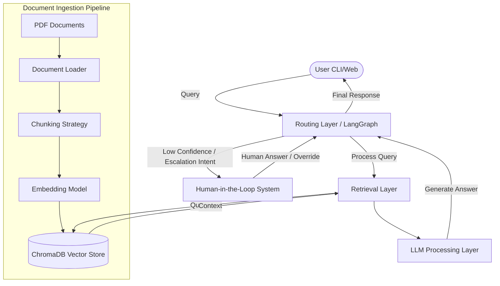

# High-Level Design (HLD): RAG-Based Customer Support Assistant

## 1. System Overview
**Problem Definition:** Customers often have repetitive queries that can be answered using existing company knowledge bases (e.g., policy PDFs, manuals). Manually answering them is time-consuming and unscalable.
**Scope:** A Retrieval-Augmented Generation (RAG) system that ingests PDF knowledge bases, answers user queries contextually, and routes complex or low-confidence queries to a human agent using a LangGraph-based Human-in-the-Loop (HITL) workflow.

## 2. Architecture Diagram

## 3. Component Description
- **Document Loader:** Reads PDF files and extracts raw text using libraries like PyPDF2 or Langchain's PyPDFLoader.
- **Chunking Strategy:** Splits the extracted text into manageable, semantically meaningful chunks (e.g., RecursiveCharacterTextSplitter) to ensure context fits within LLM token limits.
- **Embedding Model:** Converts text chunks into dense vector representations (e.g., OpenAI embeddings, HuggingFace embeddings).
- **Vector Store:** ChromaDB stores the embeddings and enables fast, similarity-based retrieval (k-NN search).
- **Retriever:** Queries the Vector Store with the user's embedded query to fetch the top-k most relevant document chunks.
- **LLM:** The core language model (e.g., GPT-4o, Claude, Llama 3) that synthesizes the retrieved chunks and the user's query into a coherent response.
- **Graph Workflow Engine:** LangGraph orchestrates the state machine (nodes and edges) for processing queries.
- **Routing Layer:** A conditional logic component in LangGraph that checks the intent or confidence score to decide whether to output the LLM's answer or escalate.
- **HITL Module:** Pauses the graph execution, alerts a human agent, and waits for their input to resume and complete the response.

## 4. Data Flow
1. **Ingestion:** PDF -> Document Loader (Text) -> Chunker (Text Chunks) -> Embedder (Vectors) -> ChromaDB (Storage).
2. **Query Lifecycle:**
   - User inputs a query.
   - The query is embedded and searched against ChromaDB.
   - Top relevant chunks are retrieved.
   - LLM generates a response based on the query + chunks, along with a confidence score/intent.
   - LangGraph checks the state: if confident, return answer; if escalation needed, pause and trigger HITL.
   - Human provides input -> LangGraph resumes -> Answer returned to user.

## 5. Technology Choices
- **Why ChromaDB:** It is an open-source, lightweight, and locally runnable vector database, perfect for rapid prototyping and moderate-scale deployments.
- **Why LangGraph:** It provides a robust framework for stateful, multi-actor applications, making it trivial to implement conditional routing and cyclic workflows like HITL, compared to standard linear LangChain pipelines.
- **LLM Choice:** OpenAI's `gpt-4o-mini` or similar for high reasoning capability and cost-effectiveness. Local models (like Llama-3 via Ollama) can be used for privacy.
- **Framework:** LangChain for abstractions (Loaders, Splitters, Retrievers).

## 6. Scalability Considerations
- **Handling Large Documents:** Use asynchronous batch processing for embeddings. Implement parallel ingestion queues.
- **Increasing Query Load:** Deploy ChromaDB in a client-server mode rather than in-memory. Put the LLM layer behind a load balancer and use caching (e.g., Redis) for frequent queries.
- **Latency Concerns:** Optimize chunk size. Use faster embedding models (e.g., `bge-small-en-v1.5`). Stream LLM responses to the user to reduce perceived latency.
